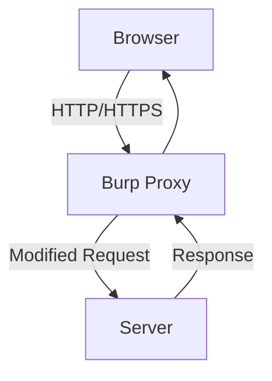
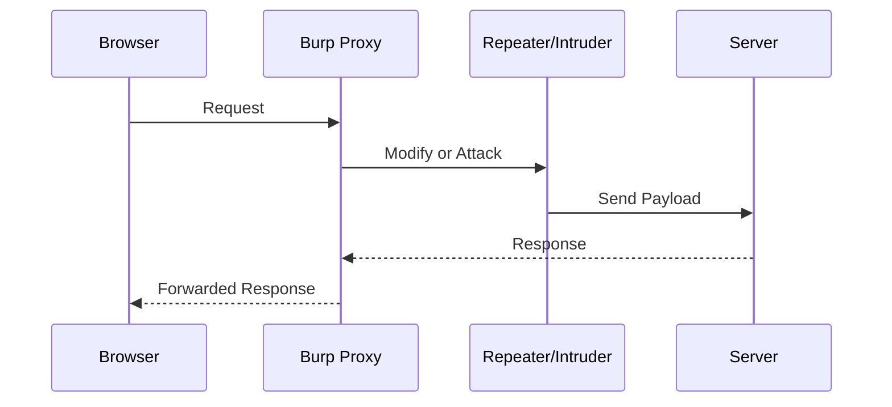

# 🛡️ Burp Suite Mastery Guide

A **complete learning guide** for **Burp Suite**, the most popular web application penetration testing tool.  
This guide is **structured, aesthetic, and practical** — designed for **self-learning, bug bounty hunting, and pentesting practice**.

---

## 📖 Table of Contents
1. [What is Burp Suite?](#-what-is-burp-suite)  
2. [Installation & Setup](#-installation--setup)  
3. [Understanding Burp Suite Interface](#-understanding-burp-suite-interface)  
4. [Key Features](#-key-features)  
5. [Core Tools Explained](#-core-tools-explained)  
6. [Burp Workflow (Step-by-Step)](#-burp-workflow-step-by-step)  
7. [Important Commands & Shortcuts](#-important-commands--shortcuts)  
8. [Configuration & Settings](#-configuration--settings)  
9. [Types of Attacks with Burp](#-types-of-attacks-with-burp)  
10. [When, Where & How to Use Burp Suite](#-when-where--how-to-use-burp-suite)  
11. [Best Practices & Tips](#-best-practices--tips)  
12. [Mermaid Diagrams (Visual Learning)](#-mermaid-diagrams-visual-learning)  
13. [Learning Resources](#-learning-resources)  
14. [Conclusion](#-conclusion)  

---

## ❓ What is Burp Suite?
Burp Suite is a **web security testing framework** developed by **PortSwigger**.  
It allows you to **intercept, analyze, and exploit** HTTP/HTTPS requests between a browser and a web server.

💡 Think of it as a **middleman** between your browser and the internet.

🔑 **Use cases:**
- Finding **SQL Injection (SQLi)**, **Cross-Site Scripting (XSS)**, **Cross-Site Request Forgery (CSRF)**  
- Testing **authentication, sessions, and cookies**  
- Automating fuzzing and brute force attacks  
- Performing **API security testing**

---

## 💻 Installation & Setup
### 🔹 1. Download Burp Suite
- [Download here](https://portswigger.net/burp)  
- Versions:
  - **Community (Free)** → Good for learning  
  - **Professional (Paid)** → Unlocks full automation (Scanner, Advanced Intruder)

### 🔹 2. Install Java (if required)
- Burp usually comes bundled with Java.  
- If not, install **JRE 11+**.

### 🔹 3. Browser Setup
1. Open Burp → `Proxy` tab → Check listener on **127.0.0.1:8080**  
2. Set browser proxy to:
   - Host: `127.0.0.1`  
   - Port: `8080`  
3. Import Burp’s **CA certificate** into the browser for HTTPS interception.

✅ Recommended: Use **Firefox** or a dedicated browser profile.

---

## 🖥️ Understanding Burp Suite Interface
Burp Suite is divided into **tabs**:

| Tab | Purpose |
|-----|---------|
| **Dashboard** | Overview, issue tracking, scanning progress |
| **Target** | Define scope, site map, organize endpoints |
| **Proxy** | Intercept requests/responses |
| **Intruder** | Automated attack engine |
| **Repeater** | Modify & resend requests manually |
| **Sequencer** | Test randomness in tokens |
| **Decoder** | Encode/Decode (Base64, Hex, URL, etc.) |
| **Comparer** | Compare two requests/responses |
| **Extender** | Install extensions from **BApp Store** |

---

## ⭐ Key Features
✔️ **Intercept Traffic** → See & edit requests in real-time  
✔️ **Scope Management** → Define what you want to test  
✔️ **Manual + Automated Testing** → Balance between control & efficiency  
✔️ **Scanner (Pro)** → Automated vuln detection  
✔️ **Plugin Support** → Extend functionality with BApp Store  

---

## 🛠️ Core Tools Explained
### 🔹 Proxy
- Captures requests & responses
- Modify before forwarding
- Example: Change cookies, headers, or parameters

### 🔹 Repeater
- Manually send requests repeatedly
- Test parameter manipulation
- Example: Change `id=1` → `id=2` and observe

### 🔹 Intruder
- Automates attacks using **payloads** (usernames, passwords, fuzzing strings)
- Attack types:
  - **Sniper** (one variable at a time)  
  - **Battering ram** (same payload in multiple places)  
  - **Pitchfork** (parallel payloads)  
  - **Cluster bomb** (all combinations)  

### 🔹 Scanner (Pro only)
- Automatic scan for common vulnerabilities

### 🔹 Sequencer
- Analyzes randomness of session tokens

### 🔹 Decoder
- Encode/Decode (URL, HTML, Base64, Hex)

### 🔹 Comparer
- Highlight differences between two responses

## ⌨️ Important Commands & Shortcuts

| Action                | Shortcut           |
| --------------------- | ------------------ |
| Forward request       | `Ctrl + F`         |
| Intercept On/Off      | `Ctrl + T`         |
| Send to Repeater      | `Ctrl + R`         |
| Send to Intruder      | `Ctrl + I`         |
| Send to Decoder       | `Ctrl + U`         |
| Send to Comparer      | `Ctrl + Shift + C` |
| Clear intercept queue | `Ctrl + Shift + Q` |

---

## ⚙️ Configuration & Settings

* **Proxy Listener** → Default `127.0.0.1:8080`
* **SSL Certificates** → Install CA cert in browser
* **Scope** → Limit to target domains
* **Logging** → Enable request/response history
* **User Options** → Hotkeys, themes, SSL settings

💡 Pro tip: Save your **Burp Project File** (`.burp`) to continue sessions later.

---

## 💣 Types of Attacks with Burp

* **SQL Injection** → Modify parameters (`id=1' OR '1'='1`)
* **XSS (Cross-Site Scripting)** → Inject ``
* **CSRF (Cross-Site Request Forgery)** → Modify forged POST requests
* **Authentication Testing** → Brute force logins with Intruder
* **Session Hijacking** → Manipulate cookies/tokens
* **API Testing** → Capture and fuzz API endpoints

---

## 🕵️ When, Where & How to Use Burp Suite

✅ **When:**

* Security testing (web apps, APIs)
* Bug bounty hunting
* Red team assessments

✅ **Where:**

* Websites, APIs, login forms, session handling
* Anywhere HTTP/HTTPS traffic flows

✅ **How:**

* Intercept → Analyze → Modify → Exploit → Report

---

## 💡 Best Practices & Tips

* 🔒 Always define **scope** → prevents testing unrelated domains
* 🛑 Use **Intruder responsibly** → avoid DoS attacks
* 🧑‍💻 Combine manual & automated testing
* 📑 Document every finding
* 🔄 Keep Burp updated & explore **BApp Store extensions**
* 🧪 Practice on **legal targets** like:

  * [PortSwigger Labs](https://portswigger.net/web-security)
  * [OWASP Juice Shop](https://owasp.org/www-project-juice-shop/)

---

## 🎨 Mermaid Diagrams (Visual Learning)

### Burp Suite Architecture

### Attack Process

---

## 📚 Learning Resources

* 📘 [Burp Suite Academy](https://portswigger.net/web-security) (Free training)
* 📖 [Official Documentation](https://portswigger.net/burp/documentation)
* 🎥 YouTube Channels → *Stök, LiveOverflow, InsiderPhD*
* 🏆 Bug bounty writeups on [HackerOne](https://hackerone.com) & [Bugcrowd](https://bugcrowd.com)

---

## ✅ Conclusion

Burp Suite is the **Swiss Army Knife of web security testing**.
By mastering **Proxy, Repeater, and Intruder**, and practicing responsibly, you can move from **beginner → intermediate → advanced pentester**.

🚀 **Next Step:** Practice daily on labs and real-world applications!

`
