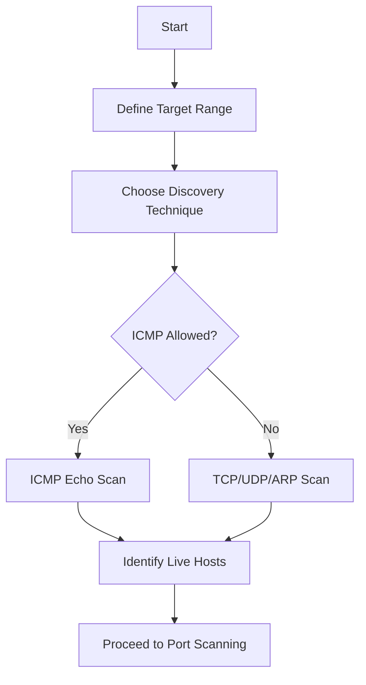
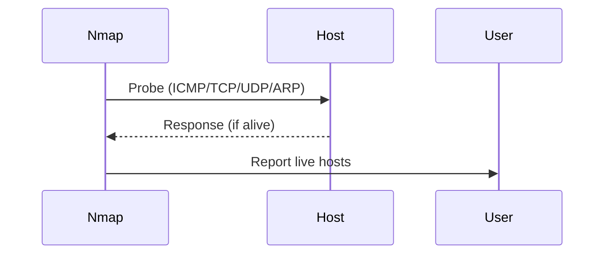

# 🌐 Nmap: Live Host Discovery Guide

A **complete learning guide** for **Nmap host discovery**, one of the most important phases in network reconnaissance.
This guide is **structured, aesthetic, and practical** — designed for **self-learning, network auditing, and pentesting practice**.

---

## 📖 Table of Contents

1. [What is Host Discovery?](#-what-is-host-discovery)
2. [Why Use Nmap for Host Discovery?](#-why-use-nmap-for-host-discovery)
3. [Installation & Setup](#-installation--setup)
4. [Discovery Techniques](#-discovery-techniques)
5. [Important Commands](#-important-commands)
6. [Workflow (Step-by-Step)](#-workflow-step-by-step)
7. [Comparison of Methods](#-comparison-of-methods)
8. [Mermaid Diagrams (Visual Learning)](#-mermaid-diagrams-visual-learning)
9. [Best Practices & Tips](#-best-practices--tips)
10. [Learning Resources](#-learning-resources)
11. [Conclusion](#-conclusion)

---

## ❓ What is Host Discovery?

**Host discovery** is the process of identifying **which machines are alive** in a network before scanning their services and ports.

💡 Think of it as a **roll call** in a classroom: you first check **who’s present** before talking to them.

🔑 **Use cases:**

* Enumerating **live targets** before a penetration test
* Network administrators auditing connected devices
* Troubleshooting connectivity or firewall issues

---

## 🚀 Why Use Nmap for Host Discovery?

* 📡 Supports **multiple techniques**: ICMP, ARP, TCP, UDP
* 🔀 Works on both **local LANs** and **remote networks**
* ⚡ **Fast & customizable** with flags and timing options
* 🔐 Helps avoid unnecessary port scanning on dead hosts

---

## 💻 Installation & Setup

### 🔹 1. Download & Install

* [Download Nmap](https://nmap.org/download.html)
* Linux:

  ```bash
  sudo apt install nmap   # Debian/Ubuntu
  sudo yum install nmap   # CentOS/RHEL
  ```

### 🔹 2. Verify Installation

```bash
nmap --version
```

✅ You’re ready to begin scanning.

---

## 🛠️ Discovery Techniques

### 🔍 1. ICMP Echo (Ping Scan)

```bash
nmap -sn 192.168.1.0/24
```

* Sends ICMP Echo requests.
* Fast but often **blocked by firewalls**.

---

### 📡 2. ARP Scan (Local Networks)

```bash
sudo nmap -PR 192.168.1.0/24
```

* Uses ARP requests (bypasses ICMP restrictions).
* Most **reliable** in LAN environments.

---

### 🔐 3. TCP SYN Discovery

```bash
nmap -PS22,80,443 192.168.1.0/24
```

* Sends SYN packets to selected ports.
* Works even if ICMP is blocked.

---

### 🔒 4. TCP ACK Discovery

```bash
nmap -PA80,443 192.168.1.0/24
```

* Sends ACK packets.
* Helps bypass some firewalls.

---

### 📦 5. UDP Ping Discovery

```bash
nmap -PU53,161 192.168.1.0/24
```

* Sends UDP probes (DNS, SNMP, etc.).
* Useful when TCP is blocked.

---

### 🚫 6. No Ping (Assume All Hosts Online)

```bash
nmap -Pn 192.168.1.0/24
```

* Skips discovery phase.
* Scans all targets directly.
* ⚠️ **Very slow** and noisy.

---

## ⌨️ Important Commands

| Purpose           | Command Example                 |
| ----------------- | ------------------------------- |
| ICMP Ping Scan    | `nmap -sn 10.0.0.0/24`          |
| ARP Scan          | `sudo nmap -PR 10.0.0.0/24`     |
| TCP SYN Discovery | `nmap -PS22,80,443 10.0.0.0/24` |
| TCP ACK Discovery | `nmap -PA80,443 10.0.0.0/24`    |
| UDP Discovery     | `nmap -PU53 10.0.0.0/24`        |
| Disable Discovery | `nmap -Pn 10.0.0.0/24`          |

---

## 🧭 Workflow (Step-by-Step)

1. **Define target** (IP or subnet)
2. **Choose method** (ICMP, ARP, TCP, UDP)
3. **Run scan** with appropriate flags
4. **Analyze output** (live hosts)
5. **Proceed to port scanning**

---

## 📊 Comparison of Methods

| Method    | Pros                    | Cons                      | Best Use Case               |
| --------- | ----------------------- | ------------------------- | --------------------------- |
| ICMP Ping | Simple, fast            | Blocked by many firewalls | Quick discovery             |
| ARP Scan  | Accurate in LAN         | Only works locally        | LAN device enumeration      |
| TCP SYN   | Works when ICMP blocked | Noisy, detectable         | Internet host discovery     |
| TCP ACK   | Evades some firewalls   | Not always reliable       | Firewall testing            |
| UDP Probe | Useful if TCP blocked   | Slow, unreliable          | Detect hidden UDP services  |
| No Ping   | Scans everything        | Very slow, noisy          | When all probes are blocked |

---

## 🎨 Mermaid Diagrams (Visual Learning)

### Discovery Process



### Communication Flow



---

## 💡 Best Practices & Tips

* ✅ Use **ARP scan** for local networks (fastest & most accurate).
* ✅ Combine multiple methods if unsure.
* ✅ Start with **ICMP/ARP**, fallback to **TCP/UDP**.
* ⚠️ Avoid scanning without **permission**.
* ⚡ Use `-T4` for faster scans, but note it’s noisier.

---

## 📚 Learning Resources

* 📖 [Nmap Official Documentation](https://nmap.org/book/man-host-discovery.html)
* 🎥 YouTube → *IppSec, NetworkChuck, Hak5*
* 🧪 Practice Labs: [VulnHub](https://www.vulnhub.com/) | [TryHackMe](https://tryhackme.com/) | [HackTheBox](https://www.hackthebox.com/)

---

## ✅ Conclusion

Nmap’s **host discovery techniques** are the foundation of effective network reconnaissance.
By mastering **ICMP, ARP, TCP, UDP**, and fallback strategies, you can **confidently enumerate live systems** in any environment.

🚀 **Next Step:** Use host discovery in combination with **port scanning** to build a complete network map.

