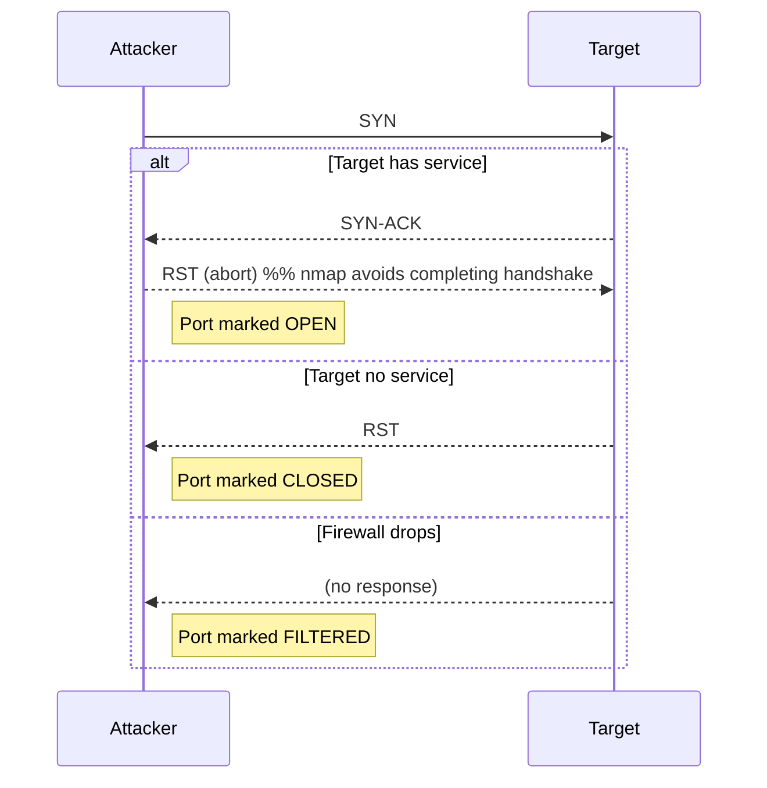
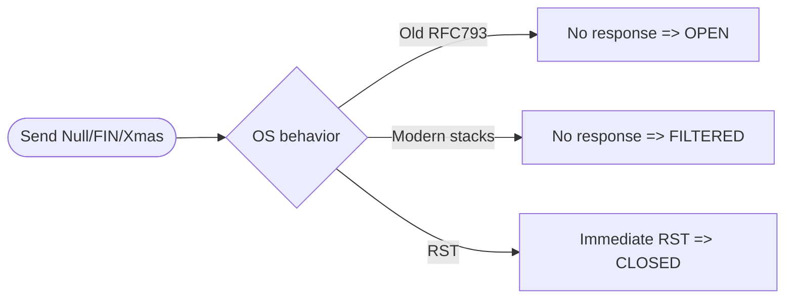

# Nmap: Advanced Port Scans

> A friendly, **ethical** step-by-step guide for security students, red-teamers (with permission), and defenders. Copy-paste this `README.md` straight into your GitHub repo.

---

> ⚠️ **Legal & Ethical Notice:** Use these techniques only on systems you own or where you have explicit written permission. Unauthorized scanning can be illegal and harmful. This guide is intended for **learning, defense, and authorized penetration testing** only.

---

# Index

1. [Introduction & Goals](#introduction--goals)
2. [Quick Reference / TL;DR Commands](#quick-reference--tldr-commands)
3. [Definitions & Port States](#definitions--port-states)
4. [TCP Advanced Scans — How & Why](#tcp-advanced-scans---how--why)
5. [UDP and Other Scan Types](#udp-and-other-scan-types)
6. [Scan Tuning & Evasion Options](#scan-tuning--evasion-options)
7. [Step-by-Step Walkthroughs (with commands)](#step-by-step-walkthroughs-with-commands)
8. [Interpreting Results — Flowchart & Mermaid Diagrams](#interpreting-results---flowchart--mermaid-diagrams)
9. [Practical Tips, Pitfalls & Hardening Advice](#practical-tips-pitfalls--hardening-advice)
10. [Output, Logging & Post-Scan Actions](#output-logging--post-scan-actions)
11. [Resources & Further Reading](#resources--further-reading)
12. [Appendix: Example Scan Templates](#appendix-example-scan-templates)

---

# Introduction & Goals

This document focuses on **advanced Nmap port scanning techniques**: how each scan works at the packet level, when to use it, how to tune it for speed or stealth, and how to read results. It mixes **commands**, **visualizations** (Mermaid), and **practical tips** — ideal for learners who want a compact but deep reference.

Goals:

* Explain advanced TCP flag scans (Null, FIN, Xmas, Maimon, ACK, Window, Custom).
* Show UDP scan behavior and pitfalls.
* Demonstrate tuning (timing, parallelism, rate) and evasion (decoys, fragmentation, spoofing).
* Provide ready-to-run command examples and templates.
* Help interpret `open`, `closed`, `filtered`, `unfiltered`, `open|filtered`, `closed|filtered`.

---

# Quick Reference / TL;DR Commands

```bash
# SYN scan (stealthy) + service/version detection + reason + output all formats
nmap -sS -sV --reason -p 1-65535 -T4 -oA scans/target_syn_scan 10.0.0.5

# Null, FIN, Xmas, Maimon (advanced flag scans) -- single command variations:
nmap -sN target          # Null (no flags)
nmap -sF target          # FIN
nmap -sX target          # Xmas
nmap -sM target          # Maimon

# ACK and Window for firewall/ACL mapping
nmap -sA target
nmap -sW target

# UDP scan (slow, noisy)
nmap -sU -p 53,123,161 -T2 -oA scans/udp_common_ports target

# Idle / Zombie scan (very stealthy, high complexity)
nmap -sI zombie_ip:probe_port target

# Decoys, spoof MAC, fragment packets, set scan flags or scan rate
nmap -D decoy1,ME,decoy2 -f --spoof-mac 0:11:22:33:44:55 --scanflags 0x12 target

# Useful flags for verbosity and debugging
-vv --packet-trace --reason -d
```

---

# Definitions & Port States

**Port states you’ll see in nmap output**

* `open` — service responded positively (e.g., SYN-ACK to SYN).
* `closed` — target replied with a TCP RST (no application listening).
* `filtered` — probe was dropped or no response (firewall/ACL may be blocking).
* `unfiltered` — probe got responses but port state unclear (common in ACK scans).
* `open|filtered` — ambiguous: could be open or filtered (UDP, some flag scans).
* `closed|filtered` — ambiguous closed vs filtered.

**Common responses mapping**

* `SYN-ACK` → usually **open** (SYN scan).
* `RST` → **closed**.
* `ICMP unreachable (type 3 code 1/2/3/9/10/13)` → **filtered** (UDP or ICMP replies).
* *No response* → usually **filtered** or packet dropped.

---

# TCP Advanced Scans — How & Why

### 1. SYN Scan (`-sS`)

* Sends a SYN; if SYN-ACK → port is **open** (sends RST to avoid full handshake). If RST → **closed**.
* Pros: Fast, stealthier than full connect.
* Cons: Detectable by stateful firewalls and IDS that watch for half-open connections.

### 2. Connect Scan (`-sT`)

* Completes full TCP 3-way handshake (uses OS connect syscall).
* Pros: Works when raw sockets are unavailable.
* Cons: Noisy and easily detected.

### 3. Null (`-sN`), FIN (`-sF`), Xmas (`-sX`) scans

* Send unusual flag sets to elicit different responses.
* Based on RFC-793 behavior: some older stacks reply differently (no flags → closed = RST; open → no response).
* Pros: Sometimes bypass poorly configured firewalls.
* Cons: Modern OSes and firewalls often normalize or filter responses (less effective).

### 4. Maimon (`-sM`)

* Sends a FIN/ACK combination (historical, targets BSD behavior). Rarely useful today but included for completeness.

### 5. ACK (`-sA`)

* Used for firewall rule discovery (stateless vs stateful). ACKs usually elicit RST if port is unfiltered. If no response → filtered.
* Not useful for open/closed detection — used to map filtering.

### 6. Window (`-sW`)

* Like ACK but inspects the TCP Window size to guess state on some stacks.

### 7. Custom flags (`--scanflags`)

* Build arbitrary flag combinations: `--scanflags 0x12` for SYN+ACK, etc.
* Useful to craft rare probes when testing IDS/IPS or experimenting.

---

# UDP and Other Scan Types

### UDP Scan (`-sU`)

* Sends UDP payloads / empty UDP packets. If `ICMP port unreachable` received → closed. No response → open|filtered.
* Very slow and noisy; many UDP services are rate-limited.
* Combine with version detection `-sV -sU` to probe protocols like DNS, SNMP, NTP.

### Idle / Zombie Scan (`-sI`)

* Uses an innocent third-party "zombie" host to probe the target; extremely stealthy because probe source appears to be the zombie.
* Requires a predictable IP ID sequence on zombie (rare on modern systems).
* Syntax: `nmap -sI <zombie_ip>:<probe_port> <target>`

---

# Scan Tuning & Evasion Options

* `-T0`..`-T5` — timing templates (0 slowstealth → 5 insane). Use `-T0`/`-T1` for stealth.
* `--min-rate`, `--max-rate` — force probe rate (pps).
* `--min-parallelism`, `--max-parallelism` — control how many probes run in parallel.
* `-f` — fragment packets (bypass naive packet filters).
* `--mtu` — change packet size (fragmentation control).
* `-D decoy1,ME,decoy3` — decoys to hide real source; list `ME` to indicate your host among decoys.
* `-S <ip>` — spoof source IP (rare, requires raw sockets and likely broken for responses).
* `--spoof-mac 0` or `--spoof-mac <vendor|mac>` — MAC spoofing.
* `--data-length` — pad probes to change signatures.
* `--scanflags 0xNN` — custom flag bits (hex).
* `--randomize-hosts` — randomize target order.
* `--scan-delay` / `--max-retries` — tune timing and retries to avoid alerts.

**Use `--packet-trace` and `--reason`** to debug why nmap classified ports the way it did:

```bash
nmap -sS --packet-trace --reason -p 22 target
```

---

# Step-by-Step Walkthroughs (with commands)

> Each walkthrough shows a realistic scenario, commands, expected outputs, and what to do next.

---

## Walkthrough A — SYN scan + version detection (default advanced)

```bash
# Create output folder
mkdir -p scans

# SYN scan, service/version detection, show reasons, sane timing
nmap -sS -sV --reason -p 1-1024 -T4 -oA scans/syn_vuln 10.0.0.5
```

**What you’ll see**

* Ports with `open` + service/version (e.g., `22/tcp open  ssh OpenSSH 8.2p1`).
* `--reason` will show `SYN-ACK` or `RST` or `no-response`.

**Next steps**

* For interesting open ports: `nmap -sV -p <port> --script vuln target` (use responsibly).

---

## Walkthrough B — UDP scan on common UDP services

```bash
nmap -sU -p 53,67,69,123,161 --max-retries 2 -T2 -oA scans/udp_quick 10.0.0.5
```

**Notes**

* `-T2` slows things to avoid false negatives.
* `--max-retries` reduces time.

---

## Walkthrough C — Null/FIN/Xmas (flag fuzzing) and custom flags

```bash
# Null scan
nmap -sN -p 1-1024 -T3 -oA scans/null target

# FIN scan
nmap -sF -p 1-1024 -T3 -oA scans/fin target

# Xmas
nmap -sX -p 1-1024 -T3 -oA scans/xmas target

# Custom flags (SYN+ACK example)
nmap --scanflags 0x12 -p 22 target
```

**Interpretation**

* If `no response` on Null/FIN/Xmas → often `open` on old stacks; on modern stacks it's frequently `filtered`. Cross-check with SYN scan.

---

## Walkthrough D — ACK scan for firewall mapping

```bash
nmap -sA -p 80,443,22 --reason -oA scans/ack target
```

**What it tells you**

* If you receive RST → host reachable/unfiltered in path.
* If no response or ICMP unreachable → filtered (firewall drops probes).

---

## Walkthrough E — Idle (zombie) scan (stealth)

```bash
# Discover a candidate zombie with predictable IPID (example)
nmap -Pn -sI 192.168.1.50:80 -p 1-1000 target
```

**Caveats**

* Requires a vulnerable/predictable zombie. Rarely works on modern OSes.
* If successful, scans appear to originate from the zombie.

---

# Interpreting Results — Flowchart & Mermaid Diagrams

### TCP handshake and SYN scan behavior (sequence diagram)



### Port state decision flowchart

```mermaid
flowchart TD
    A[Probe sent] --> B{Response?}
    B -->|SYN-ACK| C[Open]
    B -->|RST| D[Closed]
    B -->|ICMP unreachable or no response| E[Filtered]
    C --> F[Log -> Further enumerate (sV, NSE scripts)]
    D --> G[Log -> Move on]
    E --> H[Attempt alternate scan/timing/fragmentation]
```

### How Null/FIN/Xmas mapping differs (simplified)



---

# Practical Tips, Pitfalls & Hardening Advice

**Tips for accurate scanning**

* Cross-verify using multiple scan types (SYN + ACK + UDP) before concluding.
* Use `--reason` and `--packet-trace` to understand why nmap labelled ports a certain way.
* Rate-limit UDP and ICMP probes to avoid being rate-limited by the target.
* When testing IDS evasion, start extremely slow (`-T0`, `--scan-delay 2000ms`) and increase carefully.

**Pitfalls**

* Cloud load balancers / proxies may obfuscate results (responses come from front-end).
* NAT and shared IPs can make `-sI` and decoys unreliable.
* Some networks apply deep packet inspection which can normalize or block unusual flags (Null/Xmas/FIN).

**Hardening advice for defenders**

* Implement stateful firewall rules that block unsolicited traffic and only allow required flows.
* Drop (rather than reject) when possible — reduces information leakage.
* Rate limit ICMP and UDP to avoid enumeration.
* Use intrusion detection signatures for common Nmap scan patterns and tune to avoid false positives.

---

# Output, Logging & Post-Scan Actions

* Save scans: `-oN` (normal), `-oX` (XML), `-oG` (grepable), `-oA` (all).

```bash
nmap -sS -sV -oA scans/target_all 10.0.0.5
```

* Use XML output to feed other tools (e.g., `xsltproc` for HTML, or `Nmap Parser` libraries).
* Correlate with firewall logs, IDS alerts, and service banners.
* For each `open` service: consider responsible vulnerability scanning (NSE: `--script vuln`) and then ethical disclosure.

---

# Resources & Further Reading

> Canonical resources:

* Nmap book (official): [https://nmap.org/book/](https://nmap.org/book/)
* Nmap reference guide (options): [https://nmap.org/man/](https://nmap.org/man/)
* Nmap Scripting Engine (NSE): [https://nmap.org/book/nse.html](https://nmap.org/book/nse.html)

> Suggested cheat sheets / learning:

* Nmap quick reference (community guides)
* RFC 793 (TCP) — for historical behavior of flag responses

*(You can paste these links directly into your repo — they're stable sources.)*

---

# Appendix: Example Scan Templates (Copy-Paste Friendly)

### Recon friendly — conservative

```bash
nmap -Pn -sS -sV --reason --min-parallelism 10 --max-retries 2 -p 1-2000 -T2 -oA scans/target_conservative 10.0.0.5
```

### Quick discovery — fast

```bash
nmap -sS -p- --top-ports 1000 -T4 --min-rate 1000 -oA scans/target_fast 10.0.0.5
```

### Stealthy slow — evade IDS

```bash
nmap -sS -p 22,80,443 -T1 --scan-delay 500ms -f -D RND:10 -oA scans/target_stealth 10.0.0.5
# -D RND:10 uses 10 random decoys
```

### UDP focused

```bash
nmap -sU -p 53,67,69,123,161 -sV --version-intensity 0 -T2 --max-retries 1 -oA scans/target_udp 10.0.0.5
```

### Idle (zombie) scan (example)

```bash
nmap -sI 192.168.1.10:80 -p 1-1024 -oA scans/target_idle 10.0.0.5
```

---

# Make it Aesthetic — README Tips for GitHub

* Use a `scans/` directory to store outputs and tag them by date.
* Add a `badges` section at top (e.g., GitHub actions, license).
* Use fenced code blocks and Mermaid diagrams (GitHub supports mermaid).
* Organize examples by `beginner`, `intermediate`, `advanced`.

---

# Final Notes (Short Checklist)

* [ ] Always get written permission.
* [ ] Start with safe scans (`-sS -T2`) and increase or change once you understand the environment.
* [ ] Save outputs (`-oA`) for later analysis and evidence of permissioned testing.
* [ ] Cross-check ambiguous ports with different scan types and timing.
* [ ] When in doubt, analyze packets with `tcpdump`/`Wireshark` or `--packet-trace`.

---

