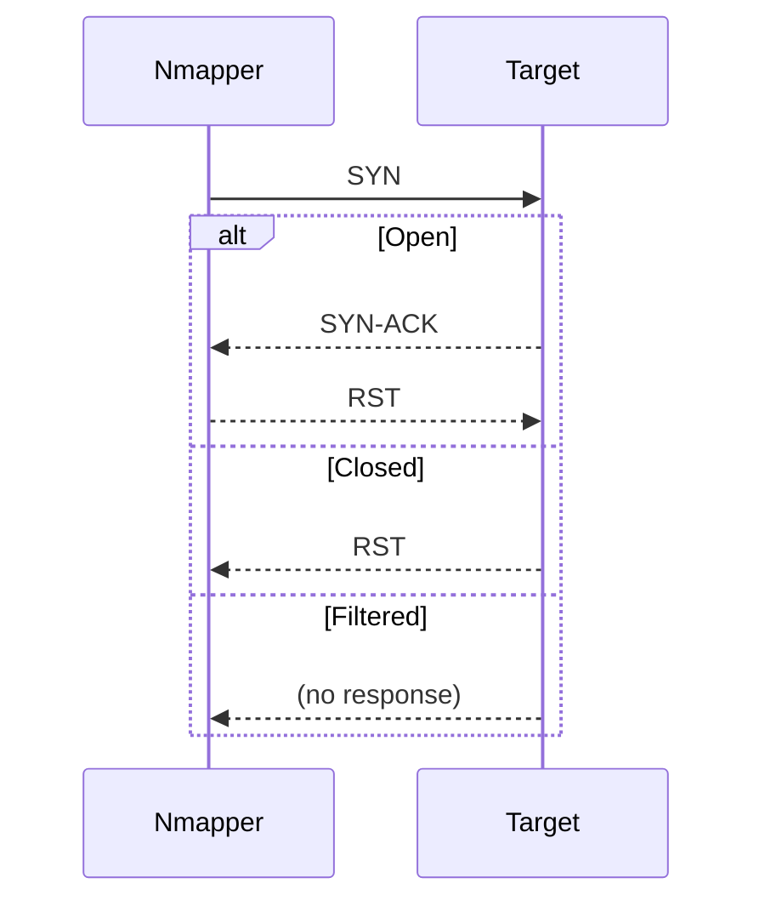

***

# Nmap: Post Port Scan Mastery
> A comprehensive, friendly, **ethical** guide for security learners, penetration testers (with permission), and defenders.

***

> ⚠️ **Ethical Notice:**  
Use these commands only on systems **you own or are authorized to test**. Unapproved scanning may be illegal or cause harm; this guide is for authorized research, learning, and defense.

***

# 🗂️ Index
1. [Introduction & Focus](#introduction--focus)
2. [TL;DR Cheat Sheet](#tldr-cheat-sheet)
3. [Scan Result States Explained](#scan-result-states-explained)
4. [Step-by-Step: Service & OS Detection](#step-by-step-service--os-detection)
5. [Nmap Scripting Engine (NSE)](#nmap-scripting-engine-nse)
6. [Traceroute & Saving Scan Output](#traceroute--saving-scan-output)
7. [Recommended Workflow Charts](#recommended-workflow-charts)
8. [Practical Advice & Pitfalls](#practical-advice--pitfalls)
9. [Hardening & Defense Tips (Blue Team)](#hardening--defense-tips-blue-team)
10. [Scan Templates (Copy/Paste)](#scan-templates-copypaste)
11. [Resources & References](#resources--references)

***

# Introduction & Focus
This guide unlocks what to do **after ports are discovered**—the essential post-port-scan phase.  
Goals:
- Learn ethical advanced scanning: service and OS detection, Nmap scripts, traceroute, and best output practices.
- Understand scan states, workflows, optimal commands, and defensive measures with live code blocks and diagrams.

***

# TL;DR Cheat Sheet

```bash
# Service version detection on found ports
nmap -sV <target>
# OS fingerprint detection over open ports
nmap -O <target>
# Fast scan common ports + save output in all formats
nmap -F -oA scans/fastscan <target>
# Run vulnerability scripts across all found services
nmap --script vuln <target>
# Save output in human, XML, and grep formats
nmap -oA scans/results <target>
```
***

# Scan Result States Explained
**What do you see in Nmap output?**

| Port State         | What It Means                              | Typical Trigger                             |
|--------------------|--------------------------------------------|---------------------------------------------|
| `open`            | Responded to probe—service is listening    | SYN scan: SYN/ACK received                  |
| `closed`          | No app listening, but replied (RST)        | RST after connect/SYN/FIN/etc.              |
| `filtered`        | Probe dropped/no reply (firewall?)         | No response/ICMP unreachable                |
| `open|filtered`   | Could be either—ambiguous                  | UDP, some advanced flag scans               |
| `unfiltered`      | Response received but state unclear        | ACK scan                                    |
| `closed|filtered` | Ambiguous (rare)                           | Uncommon                                   |

***

# Step-by-Step: Service & OS Detection

### 1. Enumerate Services  
Reveal *what* is running on each open port (critical for exploitation planning!).

```bash
nmap -sV --version-all <target>
# --version-all uses max intensity for identification (can be noisy)
```
- Use `--version-light <target>` for faster, stealthier scans.[2][3]

### 2. Detect Operating System  
Identify the target’s OS for platform-specific attacks or tuning.

```bash
nmap -O <target>
```
- Combine with service scan for full picture:
```bash
nmap -sV -O <target>
```

### 3. Practice on TryHackMe (Typical workflow)
- Start TryHackMe's AttackBox.
- Run scans, review detected service and OS versions.
- Research found services for known vulnerabilities (hint: check CVE databases).

***

# Nmap Scripting Engine (NSE)
NSE lets you automate complex checks (vuln scan, brute force, info exposure).

```bash
nmap --script vuln <target>
# Runs vulnerability scripts on all open services
nmap --script default <target>
# Runs standard info scripts (banner grab, auth checks)
# Run scripts on specific ports/services:
nmap --script http-enum -p 80 <target>
```
- Browse scripts:  
[Nmap Script Index](https://nmap.org/nsedoc/)  

***

# Traceroute & Saving Scan Output

### Trace Network Hops (post scan)
```bash
nmap --traceroute <target>
```
- Shows hops between you and target—great for mapping and evasion planning!

### Save Everything
```bash
nmap -oA scans/<basename> <full-command>
# Produces .nmap (text), .xml, .gnmap (grep) in /scans/
```

## Sequence: SYN Scan Handshake


***

# Practical Advice & Pitfalls

- After `-sV`, always research service versions for CVEs (exploit DB, vendor advisories).[6]
- Use output files (`-oA`) so you can grep, parse, and visualize results later.
- Traceroute may be blocked/dropped; don't rely only on TTL hops.
- Combine `-sV`, `-O`, and `--script` for a deeper scan when permissions and stealth allow.
- ID-sensitive servers/services (mail, RDP, admin panels) first—these matter for both red and blue teams.

***

# Hardening & Defense Tips (Blue Team)
- Block unsolicited inbound traffic at firewalls—drop rather than reject to be less noisy.
- Rate-limit ICMP/UDP and log scan attempts.
- Monitor for unusual banner-grab requests (common in NSE and service scans).
- Use IDS/IPS signatures for common Nmap patterns, but tune for real traffic.
- Periodically run scans on assets **you own** to discover misconfigurations before attackers do.

***

# Scan Templates (Copy/Paste)

**Full service & OS scan, all output:**

```bash
nmap -sS -sV -O -p 1-65535 -T4 -oA scans/full_discovery <target>
```

**Quick network sweep:**

```bash
nmap -sn 192.168.1.0/24
```

**Scripted vulnerability scan:**

```bash
nmap --script vuln -sV <target>
```

**Traceroute and output:**

```bash
nmap --traceroute -oA scans/with_route <target>
```

***

# Resources & References

- [Nmap official book and docs](https://nmap.org/book/)  
- [Nmap Cheat Sheets & Tutorials (StationX)](https://www.stationx.net/nmap-cheat-sheet/)[9]
- [TryHackMe Nmap Post Port Scans Walkthrough](https://cipherssecurity.com/tryhackme-walkthrough-nmap-post-port-scans/)[3]
- [NSE Scripts Index](https://nmap.org/nsedoc/)
- [Community guide: FromZeroToHacker Day 45](https://letslearnabout.net/hacking/from-zero-to-hero/day-045-nmap-post-port-scans/)[6]

***

# Appendix: Example Scan Templates

*Recon-friendly, slow scanning:*  
```bash
nmap -Pn -sS -sV --version-light --min-parallelism 10 --max-retries 2 -p 1-2000 -T2 -oA scans/conservative <target>
```
*Stealth plus decoys:*  
```bash
nmap -sS -p 22,80,443 -T1 -f -D RND:10 -oA scans/stealth <target>
```
*UDP-focused:*
```bash
nmap -sU -p 53,123,161 --max-retries 1 -T2 -oA scans/udp <target>
```
*Idle scan (advanced):*
```bash
nmap -sI <zombie_ip>:<probe_port> -p 1-1024 -oA scans/idle <target>
```

***

## Final Checklist
*  Always confirm permission.
*  Save outputs (`-oA`) for logging and evidence.
*  Use multiple scan types to cross-verify results.
*  Analyze ambiguous findings with detailed traces.
*  Use packet capture tools (tcpdump/Wireshark) as needed.

***

***
